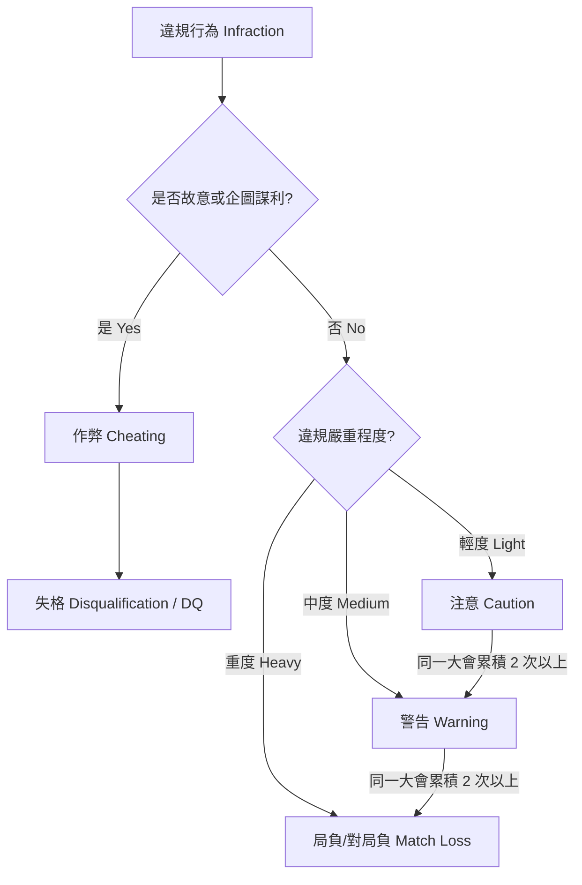

# 武士道 TCG 應用裁判與大會規則 (第4部分：罰則制度與違規定義)

本文件翻譯自 **ブシロードTCG応用フロアルール ver.1.2.11**。

---

# 罰則規定 (Penalty Guidelines) `[原書第 27 頁]`

## 第一部：判罰哲學與大會級別適用基準 `[原書第 27 頁]`

### 1. 判罰的基本目的 `[原書第 27-28 頁]`

- **維護賽事完整性：** 嚴厲懲處惡意、故意的作弊行為，確保賽事的公平性。
- **教育與防範未然：** 對於無意間犯錯的玩家，透過判罰來宣導正確規則，防止其再次違規。
- **關係者適用性：** 罰則不僅適用於玩家，也適用於旁觀者、裁判、主辦方、工作人員及媒體等所有關係者。
- **累犯加重：** 對於具有常習性、重複違規的玩家，裁判應從嚴判罰。影響力較大的人員（如裁判、武士道員工、中大型賽事高排位選手）違規時亦應從嚴執法。
- **裁量權限：** 對於本指引中未明確記載的違規，裁判應依其對賽事完整性及運營的影響程度進行判定。裁判在特定情況下享有「格降」或「格升」的裁量權。

### 2. 賽事級別與判罰鬆緊度 `[原書第 28 頁]`

- **Level 1 (娛樂店賽)：** 娛樂性 > 競技性。參賽者多為新手。對於非故意過失，**原則上不採取嚴厲判罰，以引導教育為主**。儘量確保玩家能分出勝負而非被判負。
- **Level 2 (中大型預選賽)：** 競技與娛樂並重。玩家應充分了解遊戲規則。判罰較 Level 1 嚴格，但對於首次非故意違規仍可視情況給予口頭糾正或格降。
- **Level 3 (全國總決賽級)：** 競技性為唯一重點。玩家被視為對規則有極深理解。**即使是非故意過失，亦將嚴格適用各項罰則，不予寬容。**

---

## 第二部：罰則的種類與定義 (Types of Penalties) `[原書第 28-29 頁]`

裁判在給予判罰時，必須**口頭告知**玩家違規內容與判罰項目，並將其記錄於成績單或系統中。罰則原則上僅在當次大會中累積，跨賽事不予繼承。但 DQ 處分會波及同一活動內的其他並行賽事。

### 1. 注意 (Caution) `[原書第 29 頁]`

- **適用：** 輕微、未對遊戲狀態造成重大干擾的違規。
- **記錄：** 若在同一大會中累積 **2 次以上「注意」**，裁判可將其升級為「警告」。

### 2. 警告 (Warning) `[原書第 29 頁]`

- **適用：** 中度違規，對遊戲進程或大會運營造成了妨礙。
- **記錄：** 在同一大會中因任何原因累積 **2 次以上「警告」**，原則上直接升級為**「對局負 (Match Loss)」**。

### 3. 對局負 (Match Loss) `[原書第 29 頁]`

- **適用：** 重度違規，導致當前遊戲無法繼續，或對大會進程造成重大延誤。
- **執行：** 當局對戰立刻終止，違規玩家判定為該 Match 落敗。
  - 若在輪次之間被判處 Match Loss，則適用於下一輪對戰。
  - 裁判給予 Match Loss 後，必須向主裁判申報。

### 4. 取消資格 (Disqualification / DQ) `[原書第 29 頁]`

- **適用：** 故意作弊、嚴重非紳士言行、或嚴重損害賽事完整性與公平性的行為。
- **執行：** 玩家立即被驅逐出賽，當前進行的對戰直接判負。
- **後續影響：** 主裁判及主辦方有權沒收該玩家在大會中已獲得的名次與所有獎品。

---

## 第三部：常見一般违規行為 (General Infractions) `[原書第 29 頁]`

### 1. 牌組與配件相關违規 `[原書第 29-31 頁]`

- **牌表不符 / 未提交牌表：** `[原書第 29 頁]`
  - 未在規定期限內提交牌表者：一般判處 **Match Loss**（若能即時修正並獲得裁判許可，可降為 Warning）。
  - 牌表填寫錯誤：判處 **Warning**，並須立即修正。
- **牌組非法：** `[原書第 30 頁]` 實際牌組張數不符、混入其他卡牌、不符構築限制。判處 **Warning**（Level 2+ 可判處 **Game Loss**）。
- **缺少必備道具：** `[原書第 30 頁]` 未攜帶骰子、指示物等遊戲必備道具，經口頭警告後仍未改善，判處 **Caution** 或 **Warning**。
- **標記卡與標記卡套 (Marked Sleeves)：** `[原書第 30-31 頁]`
  - 若非故意，但卡套上有折角、髒污或刮痕導致可被區分：
    - **無規律的磨損（輕度）：** 判處 **Warning**，並要求玩家更換受損卡套。
    - **有規律的磨損：** 若判定為非故意，判處 **Game Loss / Match Loss**，並強制更換卡套；若判定為故意，則升級為 **Cheating (DQ)**。

### 2. 遊戲狀態非法 (Illegal Game State) `[原書第 31-32 頁]`

- **傳遞錯誤資訊：** `[原書第 31 頁]` 向對手提供錯誤的生命值、戰場數值或公開區域資訊，導致遊戲發生混亂。非故意時判處 **Caution / Warning**。
- **遊戲狀態混亂：** `[原書第 31-32 頁]` 因玩家程序操作失誤，導致遊戲狀態無法簡單回溯。
  - **輕度（容易回溯）：** 判處 **Caution**。
  - **中度/重度（無法回溯，破壞對局公正）：** 判處 **Warning** 或 **Game Loss**。
- **漏掉自動能力 (Missed Trigger)：** `[原書第 32 頁]` 遺漏了必發的自動能力。原則上判處 **Caution / Warning**。若對手發現但故意不指出以獲取優勢，對手亦將面臨判罰。

### 3. 卡牌位置與窺視违規 `[原書第 32-34 頁]`

- **看到了不應看見的卡牌：** `[原書第 33 頁]` 在洗牌、切牌或檢索過程中，意外翻開或窺視了非公開卡牌。非故意時判處 **Caution / Warning**，並將窺視的卡牌洗回牌組。
- **多抽牌 (Drawing Extra Cards)：** `[原書第 34 頁]` 摸取了超過效果規定數量的牌並放入了手牌。
  - 若能明確判定多抽的是哪幾張，將卡牌移出並洗回；若已混入手牌且無法區分：
    - 預賽/一般局判處 **Warning**，並在裁判監督下由對手隨機抽取多抽的張數洗回牌組。
    - 競技性極高的局可判處 **Game Loss**。
- **洗牌不足：** `[原書第 37 頁]` 未實施有效洗牌即開始對局，判處 **Caution / Warning**。

### 4. 賽事進程阻礙 `[原書第 36-41 頁]`

- **遲到 (Tardiness)：** `[原書第 36 頁]`
  - 遲到 **5 分鐘以內**：判處 **Warning**。
  - 遲到 **超過 5 分鐘**：直接判處 **Match Loss**，且該玩家在未向裁判長聲明前，會被系統視為自動退賽。
- **慢玩 (Slow Play)：** `[原書第 40 頁]` 非故意地消耗過多對戰時間（思考時間過長、洗牌動作過慢）。裁判催促後仍未改善者判處 **Warning**，情節嚴重者可升級為 **Game Loss**。
- **過度切牌 (Excessive Hand Shuffling)：** `[原書第 41 頁]` 頻繁切手牌發出極大噪音，或動作過大干擾對手思考。裁判勸阻後仍未改正者，判處 **Caution / Warning**。

### 5. 行為與禮儀違規 `[原書第 35-39 頁]`

- **非紳士行為 (Unsporting Conduct)：** `[原書第 35-36 頁]` 態度惡劣、辱罵、摔牌、以無禮動作挑釁對手。輕微/中度判處 **Warning**，重度判處 **DQ**。
- **對戰中飲食：** `[原書第 38 頁]` 除非大會許可水分補給，原則上禁止在對戰桌上吃東西，違者判處 **Caution / Warning**。
- **違規使用聯網電子設備：** `[原書第 38 頁]` 對戰中接聽電話、收發簡訊、或使用非特許的輔助 App。判處 **Warning**，情節嚴重者判定為 **Cheating (DQ)**。
- **對局中記筆記：** `[原書第 39 頁]` 對戰中書寫、記錄任何卡牌資訊，判處 **Warning**。

---

## 第四部：作弊 (Cheating) `[原書第 42-44 頁]`

作弊的定義：**玩家故意且明知故犯地違反規則，企圖藉此為自己或隊友謀取不正當的遊戲優勢。**

> [!CAUTION]
> **作弊的判罰唯一結果即為：取消資格 (Disqualification / DQ)。**
> 裁判一旦確認玩家有故意作弊行為，不論大會級別，必須立即執行 DQ。

### 常見作弊類型：

1. **詐欺行為 (Fraud)：** `[原書第 42 頁]`
   - **適用條件：** 故意篡改、串通（打假賽）、欺詐與大會有關的資訊，例如公開資訊、遊戲進行程序、勝敗結果等，或企圖藉此獲取某種利益時，將適用此罰則。
   - **申報機制：** 任何關係者若判斷某位玩家正在實施欺詐行為，均可向裁判申報該情況。
   - 典型實例：故意向對手或裁判提供虛假遊戲狀態（如故意報錯生命值、隱瞞手牌數量、故意記錯分數）；透過收買、賄賂、私分獎品等交易行為操縱比賽結果。
2. **非法移動卡牌 (Illegal Card Movement)：** `[原書第 43 頁]`
   - **判罰基準：** Level 1: 失格 (DQ) / Level 2+: 失格 (DQ)
   - **適用條款與實例：** 違反遊戲規則、以物理手段移動卡牌試圖謀利時適用。例如：
     - 『故意未進行充分的隨機化（故意洗假牌/堆牌）。』
     - 『趁對手不注意時，將置卡區/控制區/控室的卡牌偷偷放入手牌。』
     - 『故意使遊戲狀態無法修正為合規狀態，或故意使遊戲陷入無法繼續進行的狀態。』
3. **故意標記 (Intentional Marking)：** `[原書第 43 頁]`
   - **判罰基準：** Level 1: 失格 (DQ) / Level 2+: 失格 (DQ)
   - 故意折疊、標記卡套或卡牌，以便在不公開狀態下識別特定卡牌（如在卡套角上折出隱秘壓痕）。
4. **不當/非法修改牌組：** `[原書第 43 頁]`
   - **判罰基準：** Level 1: 失格 (DQ) / Level 2+: 失格 (DQ)
   - 在不允許更改牌組的大會期間，故意修改牌組內容。
5. **非法外界協助 (Coaching)：** `[原書第 43 頁]`
   - **判罰基準：** Level 1: 警告~失格 (DQ) / Level 2+: 對局負 (Match Loss)~失格 (DQ)
   - 對戰中故意接受旁觀者或隊友的戰術指導；或旁觀者故意向對戰玩家通報其未公開的遊戲資訊。
6. **操縱骰子：** `[原書第 43 頁]`
   - **判罰基準：** Level 1: 失格 (DQ) / Level 2+: 失格 (DQ)
   - 故意使用不正當手段擲骰子以獲得想要的點數，或故意操縱骰子朝上的值。
7. **無資格參賽：** `[原書第 44 頁]`
   - **判罰基準：** Level 1: 失格 (DQ) / Level 2+: 失格 (DQ)
   - 被禁賽者、無入場資格者故意報名或混入賽場參賽。
8. **其他不正行為 (Other Cheating)：** `[原書第 44-45 頁]`
   - **判罰基準：** Level 1: 失格 (DQ) / Level 2+: 失格 (DQ)
   - 除了上述已列出的項目之外，若裁判判定該行為等同於不正行為（作弊），則可對實施該行為的關係者處以罰則。罰則的具體適用內容應參考本指引中的其他規定來進行判斷。 `[原書第 45 頁]`

---

# 第五部：容許之行動 (Permissible Actions) `[原書第 45-46 頁]`

## 第一章：連續行動步驟的變更 `[原書第 45 頁]`

在進行某項連續的行動時，若完全滿足下列所有條件，即使其步驟順序與原本的規則有所不同，仍可被視為已進行了合規的 Play（出牌/操作）：

- **結果一致：** 與依正確步驟進行 Play 時相比，行動完成後的最終結果完全相同。
- **無資訊優勢：** 變更步驟順序不會導致玩家能夠利用原本無法獲得的資訊。
- **對手同意或裁判認可：** 獲得對手的理解與同意，或者裁判能明確判定該狀況符合本條款。

> [!NOTE]
> 本條款並非鼓勵粗率或雜亂的 Play，亦非意在阻礙以正確步驟進行 Play。玩家或裁判均有權要求玩家依正確步驟進行操作。被要求之玩家有義務依正確步驟進行 Play。

### 【可變更步驟的範例】
- **範例 1：**
  - *原本順序*：在騎導（Ride）具有「先驅」技能的單位上方後，將該「先驅」單位呼叫（Call）至後衛隊外圈。
  - *變更後操作*：將具有「先驅」技能的單位移動至後衛隊外圈後，再將騎導單位放置於先導者外圈。
- **範例 2：**
  - *原本順序*：使用「雙重驅動!!（Twin Drive!!）」判定時，每翻開 1 張卡片便將其加入手牌。
  - *變更後操作*：使用「雙重驅動!!」判定時，先翻開 2 張卡片後，再將其一併加入手牌。
- **範例 3：**
  - *原本順序*：使用具有「成為回憶（Memory）」效果的事件卡（Event）並將其置於解決區域，在效果結算後將其置於回憶區。
  - *變更後操作*：使用具有「成為回憶」效果的事件卡，直接將其置於回憶區並結算效果。
- **範例 4（第 46 頁）：** `[原書第 46 頁]`
  - *原本順序*：因「轉生/回收標記（Comeback Icon）」效果將控室的角色卡返回手牌後，將觸發判定（Trigger Check）中翻開的卡片置於 Stock 區。
  - *變更後操作*：將觸發判定中翻開的卡片置於 Stock 區後，再因「轉生/回收標記」效果將控室的角色卡返回手牌。

### 【不可變更步驟的範例 (不合規)】
- **範例 1（第 45 頁）：** `[原書第 45 頁]`
  - *原本順序*：打出手牌中能量消耗為 2 的卡片，然後將 2 張 Stock（能量儲存區）的卡片送入控室（Control Zone / 棄牌區）。
  - *變更後操作*：先將 2 張 Stock 卡片送入控室，再打出手牌中能量消耗為 2 的卡片。
  - *不可行原因*：此時玩家在做決定前可先獲得「因送入控室而被公開的卡片內容（原本非公開）」這項原本無法獲得的資訊，因此不可變更此步驟。
- **範例 2（第 46 頁）：** `[原書第 46 頁]`
  - *原本順序*：因「能量池標記（Pool Icon）」效果將牌組頂端 1 張卡片置於 Stock 區，再將觸發判定中翻開的卡片置於 Stock 區。
  - *變更後操作*：將觸發判定中翻開的卡片置於 Stock 區後，再因「能量池標記」效果將牌組頂端 1 張卡片置於 Stock 區。
  - *不可行原因*：此操作會改變卡片置於 Stock 區的順序，導致行動完成後的最終狀態與正確步驟不一致，因此不可變更。

---

## 大會規則更新歷史 `[原書第 46 頁]`
- 2012 年 8 月 15 日：ver.1.0.0 適用開始
- 2013 年 7 月 5 日：ver.1.0.1 修訂
- 2014 年 2 月 7 日：ver.1.0.2 修訂
- 2015 年 9 月 28 日：ver.1.0.3 修訂
- 2016 年 1 月 28 日：ver.1.0.4 修訂
- 2017 年 1 月 25 日：ver.1.1.0 修訂
- 2018 年 4 月 23 日：ver.1.1.1 修訂
- 2019 年 5 月 31 日：ver.1.1.2 修訂
- 2019 年 12 月 24 日：ver.1.1.3 修訂
- 2021 年 12 月 20 日：ver.1.1.4 修訂
- 2022 年 4 月 28 日：ver.1.2.0 修訂
- 2022 年 7 月 29 日：ver.1.2.1 修訂
- 2023 年 2 月 6 日：ver.1.2.2 修訂
- 2023 年 10 月 6 日：ver.1.2.3 修訂
- 2024 年 4 月 19 日：ver.1.2.4 修訂
- 2024 年 5 月 29 日：ver.1.2.5 修訂
- 2024 年 9 月 17 日：ver.1.2.6 修訂
- 2024 年 10 月 17 日：ver.1.2.7 修訂
- 2025 年 1 月 31 日：ver.1.2.8 修訂
- 2025 年 4 月 24 日：ver.1.2.9 修訂
- 2025 年 7 月 2 日：ver.1.2.10 修訂
- 2025 年 12 月 10 日：ver.1.2.11 修訂
*(註：除了微調拼寫錯誤或統一表達方式外，主要的規則變更內容已在原書中以紅字標示。)*

